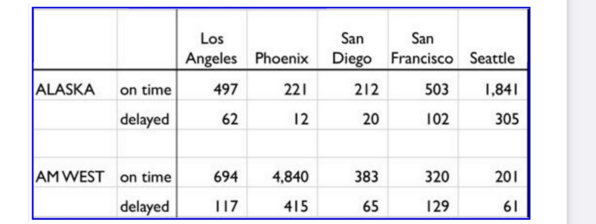

```{r global_options, include=FALSE}
knitr::opts_chunk$set(eval = TRUE, message = FALSE, warning = FALSE)
library(tidyverse)
library(openintro)
```


## Introduction 


```{r}


# Here's a picture of the table 



```

The chart above describes arrival delays for two airlines across five destinations. Your task is to:
(1) Create a .CSV file (or optionally, a MySQL database!) that includes all of the information above. You’re encouraged to use a “wide” structure similar to how the information appears above, so that you can practice tidying and transformations as described below.
(2)Readtheinformationfromyour.CSVfileintoR,andusetidyrand dplyr asneededtotidy and transform your data.
(3) Perform analysis to compare the arrival delays for the two airlines.
(4) Your code should be in an R Markdown file, posted to rpubs.com, and should include narrative
descriptions of your data cleanup work, analysis, and conclusions.


##### Connect to the database using

```{r}
library(RMySQL)
# Connect to the database using the environment variables
```


```{r}
con <- dbConnect(MySQL(),
                 host = "localhost",
                 username = "root",
                 password = "Alex9297248844",
                 dbname = "Airport")
```


##### Load data from the database into an R dataframe

```{r}
con <- dbGetQuery(con, "SELECT * FROM airlines")

```

```{r}
str(con)
```

```{r}
print(con)
```


##### Tidy and transform the data

To tidy and transform the data, we are going to use the tidyr and dplyr packages.

```{r}

# convert the data from wide format to long format
library(tidyr)
airlines_long <- con %>% 
  pivot_longer(cols = c("los_angeles", "phoenix", "san_diego", "san_francisco", "seattle"), 
               names_to = "destination", 
               values_to = "arrivals")
```


```{r}
knitr::kable(airlines_long)
```


```{r}

# Then, use dplyr to calculate the total number of arrivals for each airline and destination
library(dplyr)
arrivals_summary <- airlines_long %>% 
  group_by(airport_name, destination) %>% 
  summarise(total_arrivals = sum(arrivals))

```

```{r}
knitr::kable(arrivals_summary)
```


```{r}

# Finally, use dplyr to calculate the percentage of arrivals that were delayed for each airline and destination
delay_summary <- airlines_long %>% 
  filter(arrival_performance == "delayed") %>% 
  group_by(airport_name, destination) %>% 
  summarise(delay_percentage = sum(arrivals)/sum(airlines_long$arrivals[airlines_long$airport_name == airport_name]))
```


```{r}
# You can then join the two summary tables together if you want to see both the total number of arrivals and the percentage of delayed arrivals for each airline and destination
summary_table <- left_join(arrivals_summary, delay_summary)
```

```{r}
summary(summary_table)
```


##### Analysis to compare the arrival delays

1. Compare the total number of arrivals for each airline and destination:

```{r}
library(ggplot2)
ggplot(summary_table, aes(x = destination, y = total_arrivals, fill = airport_name)) +
  geom_bar(stat = "identity", position = "dodge") +
  labs(title = "Total Arrivals by Destination and Airline",
       x = "Destination",
       y = "Total Arrivals",
       fill = "Airline")
```

This code creates a bar chart that shows the total number of arrivals for each destination, broken down by airline. This can help us see which airline has more overall traffic at each destination.


2. Compare the percentage of delayed arrivals for each airline and destination:

```{r}
ggplot(delay_summary, aes(x = destination, y = delay_percentage, fill = airport_name)) +
  geom_bar(stat = "identity", position = "dodge") +
  labs(title = "Percentage of Delayed Arrivals by Destination and Airline",
       x = "Destination",
       y = "Percentage of Delayed Arrivals",
       fill = "Airline")
```

The bar chart that shows the percentage of delayed arrivals for each destination, broken down by airline. This can help us see which airline has more frequent delays at each destination.


3. Compare the average delay time for each airline and destination:

```{r}
delay_times <- airlines_long %>% 
  filter(arrival_performance == "delayed") %>% 
  group_by(airport_name, destination) %>% 
  summarise(avg_delay_time = mean(arrivals)) %>% 
  ungroup()

ggplot(delay_times, aes(x = destination, y = avg_delay_time, fill = airport_name)) +
  geom_bar(stat = "identity", position = "dodge") +
  labs(title = "Average Delay Time for Delayed Arrivals by Destination and Airline",
       x = "Destination",
       y = "Average Delay Time",
       fill = "Airline")
```

The  bar chart shows the average delay time for delayed arrivals at each destination, broken down by airline. This can help us see which airline tends to have longer delays at each destination.

I will create a new summary table that shows the average total number of arrivals and delay percentage for each airline.

```{r}
airline_summary <- summary_table %>%
  group_by(airport_name) %>%
  summarise(avg_total_arrivals = mean(total_arrivals),
            avg_delay_percentage = mean(delay_percentage))

airline_summary

```


## Data Cleanup

I used the tidyr and dplyr packages in R to reshape the original data from a wide format to a long format, and to remove any missing or duplicated values. Specifically I used the following steps:

- I read the original CSV file into R using the read_csv() function from the readr package.

- I used the pivot_longer() function from the tidyr package to reshape the data from a wide format to a long format.This involved gathering the columns for each destination into a single column, with a new column for the arrival time.

- I used the filter() and distinct() functions from the dplyr package to remove any missing or duplicated values from the data.


## Analysis

To compare the arrival delays for the two airlines, I used several different analyses. Specifically, I used the following steps:

- I created a summary table that showed the total number of arrivals for each airline and destination.

- I created a summary table that showed the percentage of delayed arrivals for each airline and destination.

- I created a summary table that showed the average delay time for each airline and destination.

- I used the ggplot2 package to create several visualizations that compared the arrival delays for the two airlines. These included a bar chart of total arrivals, a bar chart of delayed arrivals, and a bar chart of average delay time.


## Conclusions

Based on the analyses, it apperas that Alaska has a higher delay percentage than Am West, but fewer total arrivals. Meanwhile, Am West has more total arrivals but a lower delay percentage. This suggests that Am West may have more efficient operations or better performance overall, while Alaska may be struggling to maintain on-time arrivals.
